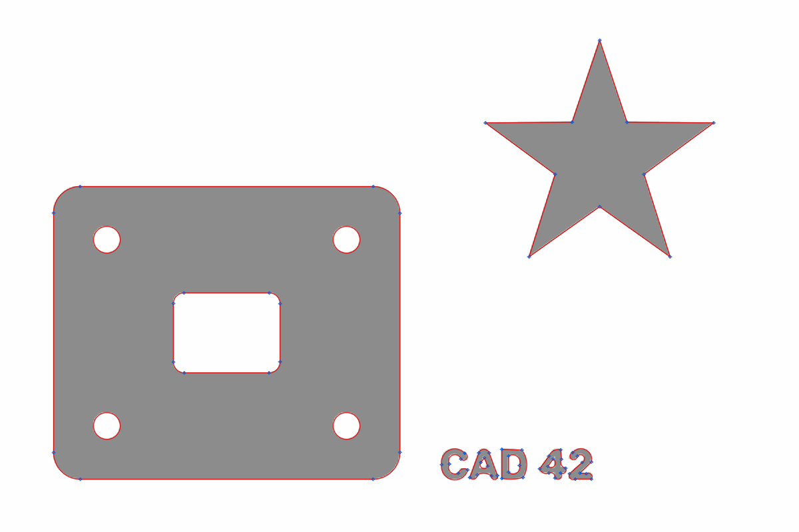

# img2dxf: accurate image to DXF converter

`img2dxf` converts raster images (PNG, JPG, BMP, TIFF, and so on) into DXF drawings that open in
AutoCAD as clean, editable geometry. The output uses real CAD primitives,
not thousands of pixel-sized segments:

* **one closed `LWPOLYLINE` per contour**, made of straight segments and true
  **arc segments** (bulges), with sharp corners and exact tangent fillets
* true **`CIRCLE`** and **`ELLIPSE`** entities for round features
* outer boundaries on layer `OUTLINE`, holes on layer `HOLES`, strokes on
  `CENTERLINE`, and optional solid fills on `FILL` (all entities `BYLAYER`)
* real-world scale and units (`$INSUNITS`), zoomed to extents, and audited with 0 errors
  (DXF R2000 to R2018, default R2010)



*Red: fitted geometry. Blue: polyline vertices. The plate is 8 vertices: 4 lines and 4 exact 90° fillets.*

## Install

```bash
pip install -r requirements.txt        # or: pip install -e .
```

## Usage

```bash
# filled shapes / silhouettes / logos / scanned parts -> outlines
img2dxf part.png -o part.dxf --width 120            # traced geometry is 120 mm wide
img2dxf scan.tif -o scan.dxf --dpi 600              # scanner resolution sets the scale
img2dxf photo.jpg -o out.dxf --threshold adaptive --denoise 10

# line drawings / sketches -> single centerlines instead of stroke outlines
img2dxf sketch.png -o sketch.dxf --mode centerline

# individual LINE/ARC entities instead of polylines, plus a visual check
img2dxf part.png -o part.dxf --entities primitives --preview

# batch
img2dxf *.png -o out_dir/
```

From Python:

```python
from img2dxf import convert, Options
res = convert("part.png", "part.dxf", Options(width=120, units="mm"))
print(res.summary())
```

Each run prints a report that includes the **maximum deviation** of the fitted CAD
geometry from the traced edge, so you can check accuracy.

### Key options

| option | meaning |
|---|---|
| `--mode outline\|centerline` | boundaries of filled regions (default), or single lines along strokes |
| `-t, --tolerance PX` | max allowed deviation of the geometry from the traced edge (default 0.5 px outline / 1.0 px centerline). Lower values are more accurate but produce more segments |
| `--scale U` / `--dpi N` / `--width W` / `--height H` / `--image-dpi` | scale: units per pixel, scan DPI, target geometry width or height, or the DPI stored in the file |
| `--units mm\|cm\|m\|in\|ft\|unitless` | drawing units written to the DXF header (default `mm`) |
| `--origin image\|geometry` | put (0,0) at the image's bottom-left corner (default) or at the geometry's minimum corner |
| `--threshold otsu\|adaptive\|0-255` | `adaptive` removes shading and uneven lighting first (photos, phone scans) |
| `--foreground auto\|dark\|light` | which side is the drawing (auto-detected from the image border) |
| `--denoise N` | denoising for noisy photos and JPEGs (for example 10 to 15) |
| `--blur S` | edge smoothing sigma in px (default 0.8) |
| `--min-area A` | drop specks and fill holes smaller than A px² |
| `--snap-ortho DEG` | make lines within DEG of horizontal or vertical exactly horizontal or vertical |
| `--no-arcs`, `--no-circles`, `--no-ellipses` | restrict the output primitives |
| `--entities polyline\|primitives` | `LWPOLYLINE`s (default) or separate `LINE`/`ARC`s |
| `--hatch` | add solid `HATCH` fills (holes stay empty) |
| `--preview [PNG]` | write an overlay of the result on the source image |
| `-j N` | worker processes (default: all cores) |

## How it gets accurate geometry

1. **Sub-pixel edges.** The image becomes a continuous intensity field instead of a
   binary mask. Edges are traced as the iso-contour (marching squares) at the level
   halfway between ink and paper intensity, which is where an anti-aliased or blurred edge
   really is. Edges are located to a small fraction of a pixel. Polarity, speckle removal
   and optional illumination flattening are handled first.
2. **Primitive segmentation.** Each contour is split greedily into the longest runs
   that fit a straight line (total least squares) or a circular arc (geometric
   circle fit) within the tolerance. Nearly flat arcs are rejected in favour of lines.
   Adjacent segments are merged when one primitive still fits them.
3. **Corner and tangent reconstruction.** Blurred corner points are discarded. Vertices
   are placed at the **intersection** of the neighbouring primitives, so sharp corners
   come back sharp. Smooth joins use the exact **tangent point**.
4. **Constrained refinement.** Points are reassigned to the segment on their side of each
   vertex and refitted over several iterations. Arcs that are tangent to neighbouring lines
   are refitted with that tangency as a constraint, which gives true fillets. A refinement
   step is kept only if it reduces the deviation.
5. **Safety net.** Any segment that does not match its data within tolerance is replaced
   by a tolerance-bounded polyline, so the output never departs from the traced edge.
6. **Centerline mode.** The stroke skeleton is re-centred to sub-pixel accuracy
   between the two stroke edges. Junctions are rebuilt as the least-squares intersection
   of the incoming strokes, and skeleton spurs are pruned.

Measured on the synthetic test images in `tests/`: circle center and radius within
0.1 px, sharp corners within 0.25 px, fillet bulges within 0.01 of the exact value.
Hard-edged (non-anti-aliased) images and noisy half-resolution JPEGs also convert
cleanly.

## Tests

```bash
pip install pytest
python -m pytest
```

## Tips

* Use the highest-resolution source you have. Accuracy scales with pixels per feature.
* For scans, pass `--dpi` so the drawing comes out at true size. Otherwise measure one known
  dimension and pass `--width` or `--height`.
* For drawings that are meant to be axis-aligned (floor plans, panels), add `--snap-ortho 1`.
* If the fit is too coarse, lower `-t`. If there are too many segments on a noisy image,
  raise `-t` or add `--denoise`.

## Also in this repository

* [`dubizzle_scraper/`](dubizzle_scraper/README.md): search, filter, analyse and export dubizzle UAE listings
  through its Algolia API, as a CLI and an MCP server. Deploy it for a Hermes agent with
  [`docs/DUBIZZLE_HERMES_DEPLOY.md`](docs/DUBIZZLE_HERMES_DEPLOY.md).
